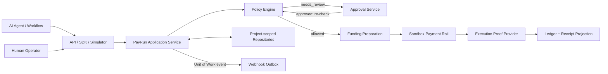

# ZenFix PayRun Architecture Baseline

**Architecture status:** Accepted baseline
**Operational readiness:** `NOT READY` — local development sandbox only
**Hosted Sandbox Gate:** not passed
**Live funds:** prohibited
**Date:** 2026-07-12
**Primary repository:** `intent-swap`
**Migration strategy:** Incremental Strangler Migration

## 1. Product boundary

ZenFix PayRun is an **Agent Payment Control Layer**. It lets AI agents spend money inside user-defined rules and turns every payment attempt into an explainable, auditable Pay Run.

ZenFix is not a DEX, wallet, stablecoin application, consumer trading surface, or payment aggregator. Existing swap capability may survive only behind the Funding Preparation port. It must never become the primary navigation, homepage, or direct payment path.

The current Next.js 14 / React 18 application remains the primary codebase. The migration must not replace the repository, introduce a parallel application, or combine a framework upgrade with a product slice.

`01_VERIFIED_BASELINE` is a behavioral/reference implementation only: it may inform domain vocabulary, fixtures, and characterization expectations, while its global repository reads, mutable aggregate replacement, plaintext/demo credentials, fallback storage, and non-transactional webhook/Approval patterns are explicitly non-authoritative. No baseline directory overlays or replaces the primary repository.

In this baseline, **Production Product** means production-grade architecture and a verifiable Hosted Sandbox. It does not mean real-money readiness. Until the live-money gates pass, every UI, API response, Receipt, health result, and operational document must identify the environment as `SANDBOX / NO REAL FUNDS`.

## 2. Non-negotiable architecture invariants

1. The only legal execution path is:

   ```text
   Intent → Policy → Funding Preparation → Payment → Execution Proof → Ledger
   ```

2. `needs_review` may insert Approval after Policy and before Funding Preparation. Approval never bypasses a fresh Policy evaluation.
3. `blocked`, `denied`, and Intent/Approval/Policy-expired Pay Runs terminate before Funding Preparation. A Funding plan/evidence expiry may terminate after a FundingPreparation exists, but always before Payment. Every expiry records `expiredAtStage` and a stable reason code; no expired PayRun has Payment or ExecutionProof.
4. Even when no asset or chain conversion is required, the lifecycle records a `FundingPreparation` with status `not_required`; callers cannot jump from Policy to Payment.
5. Payment is never considered complete until Execution Proof is collected and the Ledger transition is committed.
6. API, SDK, UI, Dashboard, Approval, Receipt, and Webhook surfaces call the same PayRun application service. None owns an alternate execution pipeline.
7. Every persisted operation is scoped by `projectId`. Identifiers alone are never an authorization boundary.
8. Mutable aggregates use version compare-and-set. Every side-effecting command requires a project-scoped idempotency key; read-only queries are the only exception.
9. Each transition atomically commits every affected aggregate CAS, the current stage artifact, idempotency result, audit event, and webhook outbox event through one Unit of Work. Callback transitions also atomically consume their inbox record.
10. Storage errors are explicit. A configured backend never silently falls back to demo or local seed data.
11. Sandbox is the default execution mode. Real funding or settlement remains disabled until the live-money gates in this document are satisfied.
12. Every migration slice is one commit, one PR, and one documented Gate. `main` must remain runnable, buildable, and rollback-safe.
13. Unknown state, timeout, missing configuration, unavailable dependency, or ambiguous external outcome fails closed. It never becomes an implicit allow or success.
14. The system does not promise exactly-once external side effects. It provides durable idempotency, at-least-once delivery, reconciliation, and evidence of the observed outcome.

## 3. System context



Branches that terminate before an external submission are persisted with audit evidence and do not call later execution adapters. Once any external value-moving request may have been accepted, the PayRun stays in reconciliation or advances through verified evidence and Ledger recording; a terminal label must never erase a known or ambiguous side effect.

## 4. Logical architecture

| Layer | Responsibility | May depend on |
| --- | --- | --- |
| Presentation | Next.js pages, route handlers, SDK facade, simulator | Application services and read projections |
| Application | Orchestrate commands, enforce state transitions, idempotency, Unit of Work | Domain and ports |
| Domain | PayRun model, policy rules, lifecycle invariants, value objects | No framework or infrastructure code |
| Ports | Repositories, funding, payment, artifact, clock, ID, webhook outbox | Domain contracts |
| Adapters | Local JSON, future hosted repository, sandbox rail, server-enforced read-only quote normalization, webhook delivery | Ports and external libraries |
| Infrastructure | Next.js runtime, wagmi/viem, filesystem, HTTP clients, deployment configuration | Adapters only |

Dependencies point inward. Route handlers must not import a concrete database, wallet, DEX, or webhook client when an application port exists.

## 5. Canonical command path

All write surfaces submit commands to the same application boundary:

```text
CreatePayRunCommand
ReviewPayRunCommand
RetryWebhookDeliveryCommand
```

The application service performs these steps:

1. Authenticate and establish `AuthContext { projectId, actorId, scopes }`.
2. Validate runtime input and resolve the idempotency key.
3. Load project-scoped aggregates.
4. Compare the expected version and state of every mutable aggregate the command will change, including PayRun, Approval, Project control, reservation, or endpoint state as applicable.
5. Execute the next legal state transition.
6. Require every compare-and-set to affect exactly one row, then atomically persist the stage artifact, idempotency result, audit event, and webhook event. Any mismatch rolls back the entire Unit of Work and returns a stable `409 version_conflict`; stale decisions are not auto-retried.
7. Return a versioned read projection.

Clients may propose a `PayIntent`; they may not submit a trusted `PolicyDecision`, `PaymentExecution`, `ExecutionProof`, Ledger result, or final status.

`projectId`, reviewer identity, actor identity, scopes, and environment come from authenticated server context. Body, query, route, and custom header values cannot override that context. LLM and natural-language parsing are untrusted proposal inputs and cannot grant payment authority.

## 6. Core modules to introduce incrementally

The target source layout is additive and follows the existing `src/` convention:

```text
src/features/payrun/domain/
src/features/payrun/application/
src/features/payrun/adapters/
src/features/payrun/server/
src/features/funding/domain/
src/features/funding/adapters/
src/components/zenfix/
src/app/api/v1/
```

The current application remains live while these modules are introduced. New ZenFix pages are added on non-conflicting routes before the root surface changes.

## 7. Strangler boundary in the current repository

| Current area | Migration treatment |
| --- | --- |
| `src/app/providers.tsx` | Retain only in the legacy deployment; Hosted Sandbox introduces `SandboxProviders` without live transports, write hooks, or signer injection |
| `src/config/tokens.ts` | Extract into a validated chain/asset registry behind Funding ports |
| `src/app/api/swap-quote/route.ts` | Keep as a legacy-only compatibility route; Sandbox may extract only read-only quote normalization into a new adapter that cannot return calldata or transaction fields |
| `src/app/execute/page.tsx` | Keep legacy-only; executable allowance/sign/send mechanics remain outside Sandbox and require a future live-money ADR before extraction |
| `src/app/preview/page.tsx` and `src/components/SwapPreviewCard.tsx` | Reuse only funding-review concepts; do not preserve swap-first navigation |
| `src/lib/errors.ts` and `src/lib/logger.ts` | Retain as shared infrastructure candidates |
| `src/app/subscribe/**` | Legacy direct-mainnet USDT payment path; exclude from Sandbox and retire rather than migrate around PayRun |
| `src/app/activity/**` | Preserve only on an independent legacy recovery origin until Vault funds/orders are safely resolved; exclude from Sandbox |
| `src/app/portfolio/**`, `src/lib/history.ts` | Legacy read/history compatibility only; never Funding, Proof, or Ledger authority |
| `src/app/conditional-order/**`, `src/app/api/orders/**` | Keep untouched for legacy rollback; exclude from the first ZenFix pilot |
| `src/app/api/cron/health-check/**`, `src/hooks/useWebPush.ts`, `public/sw.js` | Legacy monitor/notification operations; exclude from Hosted Sandbox and separately retire or re-scope |
| `monitor/**` | Keep operationally isolated; do not reuse as PayRun persistence or webhook outbox |
| `contracts/**` and `src/lib/vault.ts` | Exclude from sandbox pilot and any production payment claim pending a separate security decision |

This extraction map is pinned to repository baseline commit `f8a94f6`. A later change to a legacy path requires the relevant boundary and denylist to be reviewed again.

## 8. Runtime modes and feature flags

| Control | Initial value | Meaning |
| --- | --- | --- |
| `ZENFIX_DEPLOYMENT_PROFILE` | `legacy` | Build-time capability boundary: `legacy` or future `hosted_sandbox`; it cannot be changed inside a running artifact |
| `ZENFIX_PRODUCT_SURFACE` | `legacy` | Presentation selection inside an allowed deployment profile; it cannot add routes, signer, RPC, credentials, or egress excluded by that profile |
| `ZENFIX_EXECUTION_MODE` | `sandbox` | Payment adapters cannot broadcast real settlement |
| `ZENFIX_REAL_FUNDING_EXECUTION_ENABLED` | `0` | Funding adapters may simulate or quote but may not execute real conversion or bridge operations |
| `live_execution_enabled` | `false` | Default-deny persisted control; no flag alone can enable a live rail |

Environment flags are an outer safety boundary; persisted Project and Policy state remains the business source of truth. The most restrictive result wins.

### Sandbox physical isolation

The current repository contains real-chain capabilities, including wallet transaction calldata, deployed Vault addresses, keeper signing, and manual execution. Therefore:

- Before the physical-isolation Gate passes, ZenFix may run only as a local development sandbox and must not be described as a Hosted Production Sandbox.
- A Hosted Sandbox build or deployment manifest must include only sandbox adapters and must exclude real signer, keeper, raw transaction broadcast, `monitor/manual-exec.js`, Vault execution, contract deployment, and direct swap execution paths.
- The Hosted Sandbox runtime has no real private keys, real rail credentials, mainnet write RPC permission, or network egress to real payment/funding rails.
- Injecting a real credential, deployed Vault target, or mainnet write endpoint into the Sandbox profile is a startup error and an operational alert.
- The legacy Intent Swap deployment remains a separate migration-era security domain. New ZenFix commands cannot fall back to its routes when a sandbox adapter is unavailable.
- A shared repository does not imply a shared runtime artifact, IAM role, credential store, or egress policy.

### Deployment profiles and rollback boundary

The repository produces separate security artifacts:

- `intent-swap-legacy`: the migration-era legacy surface and recovery routes, deployed on its own origin with legacy IAM, secrets, and egress.
- `zenfix-hosted-sandbox`: a route/build allowlist containing only ZenFix Sandbox code. It hard-pins the ZenFix surface and rejects a request to select `legacy` at startup.

This is not a parallel application or second codebase: both artifacts are release profiles of the one `intent-swap` repository and the one canonical PayRun domain. The legacy artifact exists only for migration/recovery and cannot become a second ZenFix implementation.

During local migration, a developer build may contain both surfaces for characterization and rollback testing; that build is never a Hosted Sandbox artifact. `ZENFIX_PRODUCT_SURFACE` controls presentation only inside the capabilities permitted by its deployment profile. Slice 10 may use the flag at a deployment/traffic-routing boundary, but it cannot make excluded legacy execution modules appear inside `zenfix-hosted-sandbox`.

Hosted Sandbox rollback means redeploying the preceding Sandbox artifact, closing new Sandbox intake, or routing traffic to the separately built legacy origin. It never activates `/execute`, `/subscribe`, `/activity`, orders, monitor, Vault, live wallet transports, or executable quote code inside the Sandbox artifact.

## 9. Consistency and delivery semantics

- Internal state transitions are optimistic and versioned, not last-write-wins.
- Idempotency records enforce `UNIQUE(project_id, command_type, idempotency_key)`, store a canonical request hash, and move through `in_progress`, `completed`, or `unknown`. The record, prepared attempt, and originating business transition commit together; external calls occur later under a lease/CAS worker. Execution keys cannot be reused during the financial reconciliation and record-retention period.
- Webhook delivery is at-least-once through an outbox. Events enforce `UNIQUE(project_id, event_id)` and retain immutable payload, schema version, and aggregate version. A worker claims with owner/expiry lease and CAS; attempts append separately with exponential backoff, jitter, and DLQ. Receivers deduplicate by stable event ID.
- Payment and funding adapters accept a caller-supplied deterministic execution key and support lookup by that key even when the first response is lost. A rail without that recovery contract is unsupported.
- Audit events live in an independent append-only store with `UNIQUE(project_id, aggregate_type, aggregate_id, sequence)`. They record before/after aggregate versions, authenticated actor, action/reason code, idempotency/correlation IDs, and database time. The runtime role can insert/read but cannot update/delete them, and secrets are redacted.
- Receipts are immutable, versioned snapshots materialized from committed PayRun and Ledger data. `receiptVersion` is distinct from `receiptSchemaVersion`; records enforce `UNIQUE(project_id, pay_run_id, receipt_version)`, include canonical content hash and Sandbox watermark, and corrections append `supersedesVersion`. Historical GETs never recompose a receipt from current state.
- An external timeout after submission produces an `unknown` attempt that must be reconciled by stable provider reference; it is not blindly retried or converted to failure.

Each transition Unit of Work atomically writes `PayRun CAS + affected stage aggregate/artifact + idempotency result + AuditEvent + OutboxEvent`. A callback Unit of Work also writes `InboxEvent consumed + verified artifact`. Ledger completion atomically writes the balanced journal/entries and terminal PayRun CAS; Receipt creation is an idempotent immutable projection and cannot change the payment outcome.

## 10. Security boundary

- API key plaintext is shown once at creation. Storage retains key ID/prefix, project/environment/scopes/status/expiry/rotation metadata and a pepper-versioned HMAC-SHA-256 digest, or a separately approved equivalent; verification is constant-time.
- The only pre-authentication repository exception is a narrow `AuthKeyRepository` that locates a digest by public key ID/prefix and returns authenticated project/scopes after verification. It cannot read tenant business data. Every business repository still requires authenticated Project context.
- Webhook signing secrets are encrypted with managed key custody because delivery requires plaintext recovery; API keys remain one-way hashed. Neither is returned by list APIs or rendered by public pages.
- Every API repository call includes `projectId`; tests must prove cross-project identifiers return not found.
- Policy decisions are server-generated, versioned, explainable, and rechecked after Approval.
- Funding, payment, artifact, and webhook URLs require allowlisting and SSRF controls before outbound HTTP is enabled.
- No real private key, wallet signer, or settlement credential is required for the sandbox pilot.
- RLS is defense in depth, not a substitute for project-scoped repository contracts and least-privilege database roles. The request-path role cannot use `BYPASSRLS` or a service-role tenancy shortcut.
- Hosted storage unavailability returns `503` and blocks execution. Empty data is valid and never replaced with demo records.
- Webhook and artifact destinations require HTTPS, private/link-local/metadata address rejection, redirect revalidation, DNS rebinding defenses, and controlled egress before HTTP mode is enabled.
- Webhook endpoint state is activated only after a real challenge-response. A locally recorded event, arbitrary `2xx`, or `skipVerification` cannot verify ownership.

### Kill-switch protocol

- Controls exist at global, environment, Project, rail, Agent, and Merchant levels; the most restrictive value wins and `live_execution_enabled=false` is the default.
- Database/control-plane unavailability, stale cache, or unreadable control state is treated as blocked.
- Intake, budget reservation, every funding/payment worker claim, and the moment immediately before each external submit read a strong-consistency control snapshot.
- Enabling live execution requires an accepted live-rail ADR, MFA, two-person authorization, CAS, short-lived authority, and append-only audit. Emergency disable may use a separately authorized break-glass path and is audited.
- Disable stops new claims and safely releases unsent reservations. An already submitted or unknown external request is reconciled; a kill switch cannot retract it.

## 11. Slice and Gate model

| Slice | Deliverable | Minimum Gate |
| --- | --- | --- |
| Architecture Baseline | This document set and accepted ADRs | Required files, link/placeholder checks, clean diff scope, typecheck, build; this does not imply operational readiness |
| 1 | Test safety net | Non-interactive ESLint, Vitest, typecheck, build, characterization smoke all pass |
| 2 | Canonical Domain | Domain and transition tests prove no lifecycle bypass |
| 3 | Project-scoped Storage | Isolation, CAS conflict, atomic state/audit/Domain-Outbox write, corruption, and no-fallback tests pass |
| 4 | Sandbox Control Loop | Allowed, Review, Blocked, and Funding mismatch scenarios, including Domain OutboxEvents, pass |
| 5 | Approval | Concurrent approval and retry tests prove one execution |
| 6 | `/api/v1` | Auth, scope, runtime schema, error, and cross-project tests pass |
| 7 | Receipt/Webhook/Export | Receipt version, HMAC, Domain-Outbox-to-webhook projection, retry, dedup, and export tests pass |
| 8 | ZenFix UI | Required pages use the canonical lifecycle while legacy root remains intact |
| 9 | Funding Layer | Adapter tests pass; sandbox remains default; no unsupported bridge is reported as prepared |
| 10 | Root cutover | Two-artifact/traffic rollback, production build, full pilot smoke, and legacy recovery route plan pass |

### Hosted Sandbox Physical-Isolation Gate

This Gate is independent of the slice Gate and is initially **not passed**. No deployment may identify itself as Hosted Sandbox or return operational `ready` until evidence includes:

1. immutable artifact digest plus SBOM/import scan
2. server and browser-chunk scans excluding denylisted routes, live RPC domains, deployed Vault/router/payment addresses, payment constants, `writeContract`, `sendTransaction`, and `eth_sendRawTransaction`
3. Next.js route-manifest negative checks for legacy execution, payment, recovery, monitor, and notification paths
4. secret/configuration scan, separate API-key namespace, least-privilege IAM, and no live credential
5. network-policy evidence denying real rail and mainnet write egress
6. startup rejection tests for live credentials, endpoints, or `ZENFIX_PRODUCT_SURFACE=legacy`
7. method-allowlisted read-only quote RPC proxy that rejects broadcast/admin/raw-transaction methods
8. no-real-transaction and explicit unsupported-bridge smoke tests

## 12. Rollback model

1. All work before Slice 10 is additive.
2. Each slice is independently revertible by its single commit while schema compatibility permits.
3. Before Hosted isolation, `ZENFIX_PRODUCT_SURFACE=legacy` restores the root only in a local/migration profile. A Hosted Sandbox rolls back to its prior Sandbox artifact or routes traffic to the independent legacy deployment; it cannot load legacy execution into the Sandbox artifact.
4. Storage migrations are additive and versioned. Destructive schema removal requires a later ADR and a separate release.
5. Routine deploy rollback pauses intake/workers, expires or safely hands off leases, and deploys an N-1-compatible artifact. It never restores an older business snapshot or deletes newer idempotency, Audit, Ledger, Receipt, inbox, or outbox records.
6. PITR is disaster recovery only; it requires recorded RPO/RTO, restore drills, and post-restore reconciliation of every external attempt and delivery.
7. Existing monitor, subscription payment, activity recovery, and conditional-order infrastructure is retired only after the ZenFix replacement and operational/recovery Gate have been verified.

## 13. Live-money unlock gates

Real funding or settlement remains prohibited until all of the following have explicit evidence:

- Pilot acceptance demonstrates that users understand intent, policy reason, payment result, and execution proof.
- Project isolation, CAS, idempotency, policy recheck, kill switch, audit export, receipt versioning, and webhook outbox tests pass.
- A real rail is implemented behind a separate adapter and feature flag.
- Merchant allowlists, amount limits, reconciliation, incident response, and rollback runbooks are approved.
- Funding and payment contracts or integrations receive the required independent security review.
- A new ADR accepts the specific live rail and its failure model.

## 14. Architecture document map

- [Domain model](./DOMAIN_MODEL.md)
- [PayRun state machine](./PAYRUN_STATE_MACHINE.md)
- [Policy engine](./POLICY_ENGINE.md)
- [Funding layer](./FUNDING_LAYER.md)
- [Architecture decisions](./ADRs/README.md)
- [UI refinements backlog](../design/UI_REFINEMENTS_BACKLOG.md)
