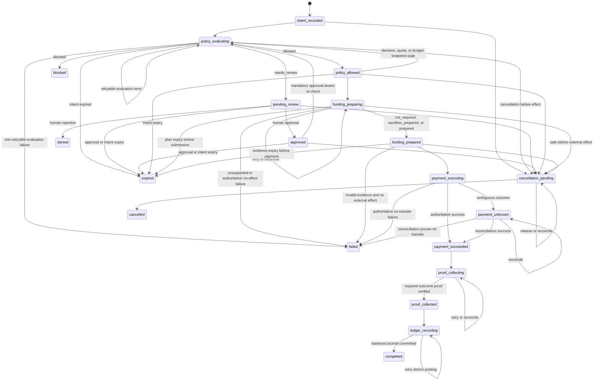

# PayRun State Machine

**Status:** Canonical baseline
**Date:** 2026-07-12

## 1. Purpose

The PayRun state machine is the sole authority for advancing a payment attempt. Controllers, route handlers, UI components, workers, adapters, and webhooks may request transitions; they may not assign status directly.

The lifecycle is:

```text
Intent → Policy → [Approval when required] → Funding Preparation → Payment → Execution Proof → Ledger
```

## 2. Canonical states

```text
intent_recorded
policy_evaluating
policy_allowed
pending_review
approved
funding_preparing
funding_prepared
payment_executing
payment_unknown
payment_succeeded
proof_collecting
proof_collected
ledger_recording
completed
blocked
denied
expired
cancellation_pending
cancelled
failed
```

Only one canonical PayRun state field exists. Adapter-specific booleans such as `triggered`, `autoExecuted`, or `success` cannot represent PayRun status. `completed` means that the controlled lifecycle and Ledger posting finished; it is not a claim that the paid task outcome was positive.

## 3. Transition graph

The state-requirements table in Section 4 is normative. The Mermaid graph is a visual rendering of the same edge set and must be checked against the table in the Slice 2 Gate.



After an external funding or payment request may have been accepted, cancellation cannot promise reversal. The PayRun stays in execution/reconciliation until an authoritative outcome is known and any observed value movement is accounted for.

## 4. Normative transition table

| State | Required committed data | Legal next states |
| --- | --- | --- |
| `intent_recorded` | immutable PayIntent and intent digest | `policy_evaluating`, `cancellation_pending` |
| `policy_evaluating` | evaluation attempt metadata | retry same state, `policy_allowed`, `pending_review`, `blocked`, `failed`, `expired`, `cancellation_pending` |
| `policy_allowed` | current PolicyDecision=`allowed` | `policy_evaluating`, `funding_preparing`, `expired`, `cancellation_pending` |
| `pending_review` | PolicyDecision=`needs_review`, pending ApprovalRequest | `approved`, `denied`, `expired`, `cancellation_pending` |
| `approved` | immutable human ApprovalDecision bound to scope/reasons | `policy_evaluating`, `expired`, `cancellation_pending` |
| `funding_preparing` | FundingPreparation request and plan digest | retry/reconcile same state, `funding_prepared`, `failed`, `expired`, conditional `cancellation_pending` |
| `funding_prepared` | valid `not_required`, `sandbox_prepared`, or evidence-backed `prepared` | `payment_executing`, `expired`, `failed`, `cancellation_pending` |
| `payment_executing` | immutable PaymentInstruction and prepared attempt | `payment_succeeded`, `payment_unknown`, `failed` |
| `payment_unknown` | deterministic execution key and reconciliation schedule | retry same state, `payment_succeeded`, `failed` |
| `payment_succeeded` | PaymentExecution evidence matching instruction | `proof_collecting` |
| `proof_collecting` | proof request bound to Payment | retry/reconcile same state, `proof_collected` |
| `proof_collected` | verified ExecutionProof of the task outcome, including verified negative outcome | `ledger_recording` |
| `ledger_recording` | prepared balanced journal/entries and audit data | retry same state, `completed` |
| `completed` | balanced LedgerJournal committed | terminal |
| `blocked` | PolicyDecision=`blocked` and reasons | terminal |
| `denied` | human rejection evidence | terminal |
| `expired` | `expiredAtStage`, stable reason code, expiry evidence, and safe reservation release | terminal |
| `cancellation_pending` | immutable cancellation request; release/reconciliation command if needed | retry same state, `cancelled` |
| `cancelled` | cancellation and safe funding release evidence | terminal |
| `failed` | failure record proving stage and authoritative no-value-movement outcome when an external call was attempted | terminal |

The `failed` edge from `funding_prepared` is legal only before Payment and only when invalid evidence is detected without external value movement. Expiry or cancellation from Funding is legal only before an irreversible/ambiguous effect, or after authoritative safe-release evidence. Otherwise the PayRun remains in Funding reconciliation.

## 5. Transition protocol

Every command follows the same protocol:

1. Resolve `AuthContext` and project scope on the server.
2. Load the PayRun and affected stage aggregates by `projectId` and ID.
3. Resolve the project/command-scoped idempotency record and canonical request hash.
4. Validate expected version and current state for every aggregate the command will mutate.
5. Validate transition preconditions and required evidence.
6. Within one Unit of Work:
   - compare-and-set every affected aggregate; each predicate must match exactly one row
   - persist the current stage artifact and idempotency result
   - consume the InboxEvent when processing a callback
   - append structured AuditEvent
   - enqueue the stable Domain OutboxEvent; Slice 7 adds webhook projection/delivery, not optional transition recording
7. Perform external effects outside the database transaction through a prepared attempt or outbox worker.
8. Reconcile the external outcome and request the next transition using the same deterministic execution key.

Any CAS mismatch rolls back the whole Unit of Work and returns stable `409 version_conflict`. CAS prevents concurrent state overwrite; idempotency prevents command replay from duplicating a logical effect. Neither replaces the other.

If the Policy/quote/budget snapshot becomes stale before reservation, no Funding artifact is created. A new command legally transitions `policy_allowed → policy_evaluating`; its result may be allowed, require a new review, or block. It never auto-reuses the stale decision.

## 6. External effect model

- Before a funding or payment call, persist a prepared attempt with deterministic execution key and immutable instruction hash.
- A worker claims the attempt using a lease/CAS, reads a strong-consistency kill-switch snapshot, rechecks Policy, Approval, and Funding validity, then repeats the kill-switch check immediately before submit.
- The adapter accepts the caller-supplied execution key and can query by it even if the process crashes before storing the provider response. A rail without this recovery contract is unsupported.
- An ambiguous Funding submission remains inside `funding_preparing` with an unknown attempt and reconciliation schedule; it cannot be cancelled or replaced until its outcome is authoritative.
- Provider timeout after Payment acceptance becomes `payment_unknown`; retry first queries by deterministic execution key and any stable provider reference.
- Provider callbacks enter through a project-scoped InboxEvent with unique source/event ID. A callback may trigger verification; it cannot assign Payment or PayRun success.
- Exactly-once value transfer is not assumed. Duplicate prevention is layered through internal idempotency, provider keys, nonce/instruction identity, and reconciliation.

## 7. Approval path

`needs_review` is a Policy result. `approved` and `denied` are human decisions.

Approval binds:

- project and PayRun
- `createdAtPayRunVersion` as audit metadata; command concurrency separately supplies `expectedPayRunVersion`
- intent digest
- Policy ID, version, and evaluation digest
- merchant, amount, asset, chain, rail, and funding scope
- covered review reason codes
- expiry

After approval, the state returns to `policy_evaluating` with:

```text
PolicyRecheckContext {
  approvalDecisionId
  approvedScopeDigest
  coveredReasonCodes
}
```

A valid Approval satisfies only the same covered review reasons. If no hard block or new review reason exists, the deterministic result is `allowed` and records the Approval as its authorization basis. A new review reason creates a new ApprovalRequest; any hard block terminates the path. Entering Funding revalidates budget eligibility and atomically creates its reservation so concurrent spend cannot exploit a stale decision.

## 8. Terminal-state rules

- Terminal states are immutable.
- A correction or retry that changes intent, merchant, amount, settlement target, or approved scope creates a new PayRun linked by `supersedesPayRunId`.
- Settled external effects are never “rolled back” by changing status. Refund, reversal, or compensation is a new controlled PayRun and LedgerJournal.
- `failed` after a funding/payment submission is legal only when authoritative evidence proves that no value transfer occurred.
- Once Payment is known to have succeeded, a failed task result cannot skip Ledger. A verified negative result is ExecutionProof and proceeds through `proof_collected → ledger_recording`; an unavailable/unverified outcome remains in reconciliation.
- Failure to write Ledger after verified payment does not change the payment outcome; the system remains `ledger_recording` and retries safely.
- Receipt generation or webhook delivery failure cannot undo the committed PayRun/Ledger outcome and is retried independently.

## 9. Fixed scenario traces

### Allowed

```text
intent_recorded → policy_evaluating → policy_allowed
→ funding_preparing → funding_prepared
→ payment_executing → payment_succeeded
→ proof_collecting → proof_collected
→ ledger_recording → completed
```

No ApprovalRequest exists.

### Review

Pending subtrace:

```text
intent_recorded → policy_evaluating → pending_review
```

No FundingPreparation, PaymentExecution, or ExecutionProof exists while pending.

Approve subtrace:

```text
pending_review → approved → policy_evaluating(Approval context)
→ policy_allowed → funding_preparing → funding_prepared
→ payment_executing → payment_succeeded
→ proof_collecting → proof_collected → ledger_recording → completed
```

The original covered reason does not loop. A new review reason returns to a new `pending_review`; a new hard block ends at `blocked`.

Reject subtrace:

```text
pending_review → denied
```

The reject subtrace has no FundingPreparation, PaymentExecution, ExecutionProof, or LedgerJournal.

### Blocked

```text
intent_recorded → policy_evaluating → blocked
```

Funding, Payment, Proof, and LedgerJournal do not exist.

### Funding mismatch

```text
intent_recorded → policy_evaluating → policy_allowed
→ funding_preparing → funding_prepared
→ payment_executing → payment_succeeded
→ proof_collecting → proof_collected
→ ledger_recording → completed
```

Fixture annotations are exact: `PayRun.environment=sandbox`, `executionAdapter=sandbox_simulated`, `FundingPreparation.status=sandbox_prepared`, `transactionHash=null`, `realFundsAvailable=false`, and `realBridgeCapability=false`. The plan explains a source-chain ETH/SOL route to Base USDC but creates simulation evidence only.

## 10. Forbidden transitions

- Intent directly to Funding, Payment, Proof, or Ledger
- Policy directly to Payment
- Approval directly to Funding without approval-aware Policy recheck and budget reservation
- `pending_review` with any funding or payment attempt
- `blocked`, `denied`, or `expired` to any nonterminal state
- `payment_executing` directly to Proof or completion
- transaction hash directly to `payment_succeeded`
- Payment success directly to `completed` or terminal `failed`
- client session/local storage, legacy lowdb, or webhook response directly assigning canonical state
- physical deletion as cancellation

## 11. State-machine Gate

The Slice 2 Gate includes table-driven tests for every legal and illegal transition, plus tests proving:

- state-table and Mermaid edge sets are identical
- two approvals produce one final human decision
- the same idempotency scope produces one logical transition
- a version conflict produces no audit, outbox, reservation, or external side effect
- duplicate callback produces one Proof and one LedgerJournal
- `blocked` and pending Review produce no downstream records
- all four fixed fixtures assert exact state sequence, required artifacts, and forbidden artifacts
- Approval consumes only covered reason codes and cannot loop on the same unchanged reason
- Funding mismatch produces `sandbox_prepared`, no real transaction hash, and no real-chain write
