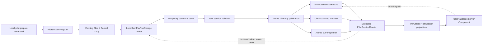

# ZenFix PV-1 — Pilot Validation Surface Implementation Plan

> **For agentic workers:** REQUIRED SUB-SKILL: Use `superpowers:executing-plans` to implement this plan task-by-task. PV-1 is one focused work unit; do not dispatch parallel writers against its shared session contracts.

**Status:** Proposed implementation baseline; no product implementation has started
**Date:** 2026-07-13
**Work unit:** Pilot Validation Surface / Product Validation Work Unit PV-1
**Classification:** Product Validation Checkpoint, not Architecture Slice 5

**Goal:** Build a local, moderated, read-only `/pilot-validation` surface that displays four immutable Sandbox PayRuns generated by the existing Slice 4 canonical Control Loop.

**Architecture:** A local preparation command is the only writer. It creates a new Local JSON store, runs all four existing Slice 4 scenarios, validates the complete canonical record set, atomically publishes an immutable Pilot Session, and atomically advances a validated current-session pointer. A dedicated `PilotSessionReader` independently reads and validates the published session without importing writer storage, a coordinator, a lease, repositories with mutation methods, a Unit of Work, or the Control Loop.

**Tech stack:** TypeScript, Next.js 14 App Router Server Components, React 18, Vitest, `vite-node`, Node.js filesystem APIs, existing canonical JSON and runtime-schema functions, existing Slice 4 Control Loop.

## Global constraints

- Canonical Local JSON store records are the only business fact source.
- The manifest stores identity, scenario mapping, provenance, expected states, and checksum binding only.
- The page and Reader are strictly read-only and never acquire a writer lease.
- No new package dependency is permitted; `vite-node`, already installed through the existing toolchain, runs the TypeScript preparation entry point.
- Every session is Sandbox-only and visibly marked `SANDBOX / NO REAL FUNDS`.
- No Approval action, Policy recheck, one-execution Gate, public API, webhook, Hosted capability, live Funding, live Payment, wallet, signer, swap, bridge, settlement, or canonical Receipt is implemented.
- Architecture Slice 5 remains Approval concurrency, Policy recheck, and one-execution guarantees; PV-1 does not change its number or scope.

---

## 1. Goal

PV-1 prepares and renders one frozen four-scenario research dataset. The dataset must be generated by the real Slice 4 application service, survive process restart, remain unchanged across page refreshes, and expose enough canonical evidence for the Product Validation Checkpoint without becoming a mutation surface.

The default local workflow is:

```text
npm run pilot:prepare
→ create unique temporary session directory
→ open new canonical Local JSON writer store
→ run Allowed, Needs Review, Blocked, Funding Mismatch
→ close writer and release lease
→ validate complete store and manifest binding
→ atomically rename session directory into sessions/<sessionId>
→ atomically update current.json
→ start local Next.js application
→ GET /pilot-validation
→ server-only PilotSessionReader loads current session
→ render immutable projections
```

## 2. Scope

PV-1 includes:

- one local `pilot:prepare` command;
- one immutable session directory per successful preparation;
- a versioned, checksummed session manifest and current pointer;
- atomic session publication and current-pointer replacement;
- complete validation of the four canonical Slice 4 records;
- a dedicated read-only `PilotSessionReader`;
- immutable `PilotSessionView` and `PilotScenarioView` contracts;
- canonical derivation of `PayRunExplanation` and `ValidationReceiptProjection`;
- Policy, Funding, Payment, Proof, Ledger, Audit, and provenance summaries;
- a local-only Next.js Server Component at `/pilot-validation`;
- safe error presentation;
- TDD coverage for preparation, atomicity, path containment, integrity, read-only behavior, projections, and page refreshes;
- `.zenfix-data/` exclusion from Git.

## 3. Non-goals

PV-1 does not include:

- Architecture Slice 5 behavior;
- Approval approve/deny/expire actions or a review queue;
- Policy recheck or competing execution commands;
- server actions or mutation route handlers;
- `POST`, `PUT`, `PATCH`, or `DELETE` endpoints;
- public `/api/v1`, webhooks, API keys, authentication, or a hosted research portal;
- canonical Receipt creation, persistence, correction, export, or delivery;
- research participant data entry, timers, scoring forms, contact storage, or Gate aggregation;
- UI navigation, Settings, Dashboard, AppShell, billing, animation, or broad product polish;
- changes to the canonical state machine, Slice 3 writer semantics, Slice numbering, Architecture, or Accepted ADRs;
- Supabase, Postgres, network filesystems, distributed readers, Hosted Sandbox, Production, or Live Money;
- real wallets, transactions, funding, swaps, bridges, settlement, or payment rails.

The five-person study and its research evidence package occur after PV-1. Research evidence remains outside PayRun financial records.

## 4. Architecture diagram



The dotted relationships are prohibited dependencies, not calls.

## 5. Preparation / Reader / UI boundary

### Preparation

Preparation is the only PV-1 writer. It may import:

- `openLocalJsonPayRunStorage`;
- `createDeterministicSandboxControlLoop`;
- `SANDBOX_PROJECT_ID`;
- pure manifest, canonical JSON, validation, and atomic-publication helpers.

It must not reproduce Policy, Funding, Payment, Proof, Ledger, or transition logic. Each scenario is executed through `SandboxPayRunControlLoopService.execute()` with a stable session-scoped idempotency key. It closes the writer before final validation and publication so no lease file enters the published directory.

### Reader

The Reader imports only server-side filesystem functions and pure contracts, schemas, checksum functions, `parseStoreEnvelope`, validation, and projection functions. It never imports:

- `local-json-storage.ts`;
- `coordinator.ts`;
- `writer-lease.ts`;
- `repositories.ts`;
- `control-loop.ts` or the Sandbox adapter factory;
- any Unit of Work or mutable repository interface.

### UI

The page imports a server-only Reader factory and presentation components. It does not accept paths, stores no client state authority, contains no form or mutation control, and calls no preparation function. The optional query parameter is only `session=<validated-sessionId>`.

## 6. Module dependency direction

```text
scripts/prepare-pilot-validation.ts
  → pilot/session-preparation.ts
    → Slice 4 Control Loop + writer storage
    → pilot/session-contracts.ts
    → pilot/session-validation.ts
    → pilot/atomic-publication.ts

pilot/session-reader.ts
  → pilot/path-safety.ts
  → pilot/session-contracts.ts
  → pilot/session-validation.ts
  → pilot/session-projections.ts
  → pure store-envelope/canonical-json functions

src/app/pilot-validation/page.tsx
  → pilot/session-reader.server.ts
  → pilot-validation-view.tsx
```

`session-reader.ts` has no dependency on preparation. Shared modules are pure and have no filesystem mutation. Static dependency tests enforce the forbidden import boundary.

## 7. Manifest schema

The manifest filename is fixed as `pilot-session-manifest.json`. The canonical store filename is fixed as `payrun-store.json`; the manifest cannot supply an arbitrary path.

```ts
type PilotScenarioName =
  | "allowed"
  | "needs_review"
  | "blocked"
  | "funding_mismatch";

interface PilotManifestScenario {
  readonly name: PilotScenarioName;
  readonly payRunId: string;
  readonly expectedFinalStatus: "completed" | "pending_review" | "blocked";
  readonly actualFinalStatus: "completed" | "pending_review" | "blocked";
}

interface PilotSessionManifestContent {
  readonly schemaVersion: 1;
  readonly sessionId: string;
  readonly createdAt: string;
  readonly sourceCommit: string; // full lowercase 40-character Git SHA
  readonly storeFile: "payrun-store.json";
  readonly storeGeneration: number;
  readonly storeEnvelopeChecksum: string;
  readonly scenarios: readonly [
    PilotManifestScenario,
    PilotManifestScenario,
    PilotManifestScenario,
    PilotManifestScenario,
  ];
  readonly preparationCommandVersion: "pv1-prepare-v1";
  readonly sandboxOnly: true;
}

interface PilotSessionManifest extends PilotSessionManifestContent {
  readonly manifestChecksum: string;
}
```

`manifestChecksum` is lowercase SHA-256 over the canonical serialization of all content fields except `manifestChecksum`. Object keys are recursively sorted and array order is preserved by the existing canonical serializer. The scenario array order is exactly Allowed, Needs Review, Blocked, Funding Mismatch. Duplicate names or PayRun IDs fail validation.

The manifest contains no raw canonical aggregate, projection, participant record, secret, absolute path, credential, lock metadata, or mutable UI state.

## 8. Pilot session schema

The fixed data root is:

```text
<repository-root>/.zenfix-data/pilot-validation/
  current.json
  sessions/
    <sessionId>/
      payrun-store.json
      pilot-session-manifest.json
```

Temporary directories use a hidden, non-session name:

```text
sessions/.preparing-<sessionId>-<operationId>/
```

The session ID format is fixed:

```text
YYYYMMDDTHHmmss.SSSZ-<7-to-12 lowercase hex Git prefix>
```

The strict expression is:

```regex
^[0-9]{8}T[0-9]{6}\.[0-9]{3}Z-[0-9a-f]{7,12}$
```

Preparation verifies the parsed timestamp is a real UTC timestamp and the suffix matches the source commit prefix. Existing final session directories are never replaced.

The current pointer is also canonical and checksummed:

```ts
interface PilotCurrentPointerContent {
  readonly schemaVersion: 1;
  readonly sessionId: string;
  readonly manifestChecksum: string;
  readonly updatedAt: string;
}

interface PilotCurrentPointer extends PilotCurrentPointerContent {
  readonly pointerChecksum: string;
}
```

The pointer contains no path. `pointerChecksum` covers canonical pointer content except itself.

## 9. Reader API

The public capability-restricted interface is:

```ts
interface PilotSessionReader {
  loadCurrentSession(): Promise<PilotSessionView>;
  loadSession(sessionId: string): Promise<PilotSessionView>;
  loadScenario(
    sessionId: string,
    scenarioName: PilotScenarioName,
  ): Promise<PilotScenarioView>;
}

interface PilotSessionView {
  readonly sessionId: string;
  readonly createdAt: string;
  readonly sourceCommit: string;
  readonly storeGeneration: number;
  readonly storeEnvelopeChecksum: string;
  readonly manifestChecksum: string;
  readonly preparationCommandVersion: "pv1-prepare-v1";
  readonly sandboxOnly: true;
  readonly watermark: "SANDBOX / NO REAL FUNDS";
  readonly scenarios: readonly PilotScenarioView[];
}

interface PilotScenarioView {
  readonly name: PilotScenarioName;
  readonly payRunId: string;
  readonly actualFinalStatus: "completed" | "pending_review" | "blocked";
  readonly explanation: PayRunExplanation;
  readonly validationReceipt: ValidationReceiptProjection;
  readonly policy: PilotPolicySummary;
  readonly approval: PilotApprovalSummary | null;
  readonly funding: PilotFundingSummary | null;
  readonly payment: PilotPaymentSummary | null;
  readonly proof: PilotProofSummary | null;
  readonly ledger: PilotLedgerSummary | null;
  readonly audit: readonly PilotAuditExplanation[];
}
```

The module exports no `save`, `update`, `append`, `delete`, `transaction`, `execute`, `prepare`, repository, UoW, coordinator, or lease member. Returned objects are recursively frozen canonical clones/projections and do not expose the parsed envelope or canonical aggregate instances.

`loadScenario` calls the same complete-session validation path as `loadSession`, then selects one scenario. It never performs a weaker partial load.

## 10. Path containment strategy

1. Resolve repository root on the server from an injected, trusted configuration; browser input never determines it.
2. Resolve the configured Pilot data root to an absolute path.
3. `lstat` the root, `sessions`, selected session, manifest, and store. Symlinks at any level fail closed.
4. `realpath` the root and selected files.
5. Require every real path to equal the root or begin with `root + path.sep`.
6. Validate `sessionId` before any session-path join.
7. Join only fixed filenames; neither manifest nor query parameters may supply a filename.
8. Require regular files for pointer, manifest, and store and a real directory for the session.
9. Reject absolute paths, separators, percent-decoded traversal, NULs, Unicode lookalike separators, malformed timestamps, and unknown session IDs with `PilotPathBoundaryError` or `PilotSessionNotFoundError`.

`loadCurrentSession()` reads `current.json` exactly once into bytes, validates its runtime schema and checksum, retains its `sessionId` and expected `manifestChecksum`, and calls the internal session loader with those fixed values. It never rereads the pointer during that load, preventing mixed-session reads.

## 11. Integrity validation sequence

`loadSession` executes exactly this fail-closed order:

1. Validate session ID syntax and timestamp semantics.
2. Resolve and prove containment of the fixed root/session paths.
3. Read the manifest bytes once.
4. Parse exact manifest fields and validate `manifestChecksum`.
5. Require manifest session ID to equal requested session ID.
6. Require `storeFile === "payrun-store.json"` and `sandboxOnly === true`.
7. Read store bytes once.
8. Call existing `parseStoreEnvelope`; this validates JSON, schema version, envelope checksum, canonical payload runtime schemas, and collection indexes.
9. Match manifest generation and checksum to the parsed envelope.
10. Require exactly four uniquely named scenario entries in frozen order and four unique PayRun IDs.
11. Resolve each mapped PayRun in the same Sandbox Project and reject missing or extra mapped identities.
12. Match expected status, manifest actual status, and canonical PayRun status.
13. Validate each scenario contract, required records, forbidden records, and Sandbox evidence.
14. Validate Audit and Outbox sequence/version lineage for each PayRun.
15. Validate completed Ledgers are balanced and tied to Payment and Proof; validate stopped scenarios have no Ledger.
16. Derive projections from canonical records.
17. Return only when all four scenarios pass; no partial result exists.

Error translation is explicit. Existing store corruption/schema errors become `PilotStoreIntegrityError` with a safe reason code and preserved internal cause for logs, never an absolute path or raw record in the UI.

## 12. Projection derivation

The Reader derives every view at load time:

- `PayRunExplanation` comes from `projectPayRunExplanation(payRun, reservation)`.
- `ValidationReceiptProjection` comes from `projectValidationReceipt(explanation)` and retains `canonicalReceiptAvailable=false`.
- Policy summary comes from the final canonical `PolicyDecision`, including Policy ID/version, outcome, reason codes, and ordered checks.
- Approval summary comes only from canonical Approval data for Needs Review.
- Funding, Payment, Proof, and Ledger summaries come only from matching canonical records and evidence references.
- Audit explanation maps canonical Audit events in sequence order to safe fields: sequence, before/after versions, action code, reason code, actor type, occurred time, and canonical from/to statuses.
- Provenance comes from validated manifest/store binding, never from client state.

Scenario-specific assertions are fixed:

| Scenario | Required | Forbidden |
| --- | --- | --- |
| Allowed | `completed`, 420000 USDC, Funding `not_required`, successful Sandbox Payment, verified Proof, balanced Ledger, consumed reservation | Approval, real transaction hash, real-funds claim |
| Needs Review | `pending_review`, 440000 USDC, needs-review decision and pending ApprovalRequest | reservation, Funding, Payment, Proof, Ledger, canonical Receipt |
| Blocked | `blocked`, 8000000 USDC, existing unknown-trust Merchant, `merchant.unknown` | Approval, reservation, Funding, Payment, Proof, Ledger, canonical Receipt |
| Funding Mismatch | `completed`, 420000 USDC, ETH/Ethereum source, USDC/Base target, `sandbox_prepared`, simulated route, successful downstream Sandbox evidence, balanced Ledger, consumed reservation | real swap/bridge/settlement, transaction hash, real funds/capability |

The page uses concise labels but always displays the canonical status. It never creates display-only canonical states.

## 13. Immutability strategy

- Published session directories are never opened by PV-1 writer code again.
- Preparation refuses an existing final session ID.
- The Reader opens files read-only and has no mutation dependency.
- Parsed envelope data is canonical-cloned by `parseStoreEnvelope`.
- Projection construction copies only safe scalar/readonly data.
- `deepFreeze` is applied to the complete `PilotSessionView` before return.
- The page receives only the frozen view and never a store payload or aggregate reference.
- Page refresh, historical navigation, build, and hot reload do not execute preparation.
- Updating samples requires a new command invocation and new session ID.
- Tests capture bytes, generation, record count, and file modification times before and after Reader/page loads.

Filesystem permissions are not claimed as a production security boundary. Immutability is an application contract for a local moderated study, backed by checksums, no overwrite, and read-only dependency design.

## 14. Cache strategy

- `/pilot-validation` exports `dynamic = "force-dynamic"` and calls Next.js `unstable_noStore()` before resolving the current pointer. The current session is never frozen at build time.
- `loadCurrentSession()` reads the pointer on every request.
- PV-1 initially performs full manifest/store integrity validation on every current or historical load. This deliberately favors a small local dataset's integrity over cache complexity.
- A future in-process historical projection cache is permitted only after it has first read and validated the current manifest/store bytes and uses the exact key `sessionId + manifestChecksum + storeEnvelopeChecksum`. It may never cache by session ID alone or serve across a changed checksum.
- No browser cache or client-side data authority is introduced.

This satisfies the immutable-history caching boundary without allowing stale cross-checksum results. Implementing the optional cache is deferred because four local PayRuns do not justify it.

## 15. Error handling

Public error classes and codes:

```ts
class PilotSessionNotFoundError extends Error {}
class PilotManifestValidationError extends Error {}
class PilotStoreIntegrityError extends Error {}
class PilotScenarioMappingError extends Error {}
class PilotPathBoundaryError extends Error {}
class PilotSessionIncompleteError extends Error {}
class PilotPublicationError extends Error {}
```

The preparation CLI prints a concise stage and safe reason, sets a non-zero exit code, leaves `current.json` unchanged, and removes only its own hidden temporary directory when publication has not occurred. It never deletes or rewrites an existing session.

If final directory rename succeeds but the later current-pointer replacement fails, the fully validated immutable session remains addressable by explicit session ID, the old current pointer remains valid, and the command exits non-zero with `PilotPublicationError`. It does not delete an already published valid session or imply that it became current.

The page maps errors to safe messages:

- no current session: “No prepared Pilot Session is available.”
- invalid/tampered session: “This Pilot Session failed integrity validation.”
- invalid session parameter: “The requested Pilot Session identifier is invalid.”
- incomplete mapping: “This Pilot Session is incomplete and cannot be displayed.”

No UI response includes an absolute path, stack trace, raw manifest/store bytes, secret, writer lock metadata, hostname, PID, or internal cause.

## 16. Proposed file list

### Add

- `scripts/prepare-pilot-validation.ts` — thin `vite-node` CLI entry; parses no business input beyond optional trusted test injection.
- `src/features/payrun/pilot/session-contracts.ts` — names, manifest/pointer/view interfaces and constants.
- `src/features/payrun/pilot/session-schemas.ts` — exact runtime parsers and checksum validation for manifest/pointer.
- `src/features/payrun/pilot/session-errors.ts` — stable safe error classes/codes.
- `src/features/payrun/pilot/path-safety.ts` — session-ID validation, no-symlink containment, fixed-path resolution.
- `src/features/payrun/pilot/session-validation.ts` — pure complete four-scenario/store/lineage validation.
- `src/features/payrun/pilot/session-projections.ts` — pure immutable projection and Audit explanation derivation.
- `src/features/payrun/pilot/atomic-publication.ts` — same-directory temp write/fsync/rename helpers for manifest, directory publication, and pointer.
- `src/features/payrun/pilot/session-preparation.ts` — orchestration of the existing Slice 4 Control Loop and publication.
- `src/features/payrun/pilot/session-reader.ts` — dedicated capability-restricted Reader implementation.
- `src/features/payrun/pilot/session-reader.server.ts` — `server-only` configured Reader factory for Next.js.
- `src/app/pilot-validation/page.tsx` — dynamic Server Component and safe error mapping.
- `src/app/pilot-validation/pilot-validation-view.tsx` — pure read-only renderer.
- `src/app/pilot-validation/pilot-validation.module.css` — minimal study-focused layout and visible Sandbox watermark.
- `src/test/payrun/pilot/session-schemas.test.ts`
- `src/test/payrun/pilot/path-safety.test.ts`
- `src/test/payrun/pilot/session-preparation.test.ts`
- `src/test/payrun/pilot/session-reader.test.ts`
- `src/test/payrun/pilot/session-projections.test.ts`
- `src/test/payrun/pilot/pilot-validation-page.test.tsx`
- `src/test/payrun/pilot/read-only-boundary.test.ts`

### Modify

- `package.json` — add only `"pilot:prepare": "vite-node scripts/prepare-pilot-validation.ts"`; no dependency change.
- `.gitignore` — add `.zenfix-data/`.
- `scripts/smoke-legacy.mjs` — add a local prepared-session `/pilot-validation` GET assertion while preserving every legacy smoke assertion; preparation is invoked by test setup, never by the page.

### Explicitly unchanged

- `docs/architecture/**`
- `docs/roadmap/**`
- `src/features/payrun/domain/**`
- Slice 4 Control Loop and deterministic Sandbox business logic
- Local JSON writer coordinator/lease/UoW semantics
- legacy swap/execute behavior
- public API routes, monitor, package dependencies, Vercel, and production configuration

If implementation reveals that a pure validation function is not exported, the only permitted storage change is a named export of an already pure function from `store-envelope.ts` or `canonical-json.ts`; no writer signature or behavior may change.

## 17. TDD order

Implementation uses one final PV-1 commit after all tests and scope review, matching the work-unit boundary. Each task still follows RED → minimal implementation → focused GREEN before the next task.

### Task 1: Manifest and pointer contracts

**Files:** `session-contracts.ts`, `session-schemas.ts`, `session-errors.ts`, `session-schemas.test.ts`

**Produces:** `parsePilotSessionManifest(text)`, `createPilotSessionManifest(content)`, `parsePilotCurrentPointer(text)`, `createPilotCurrentPointer(content)`.

- [ ] Write failing tests for exact keys, fixed schema/version/store filename, canonical checksum, tuple order, duplicate scenario/payRun mapping, invalid Git SHA, timestamps, `sandboxOnly`, and unknown fields.
- [ ] Run `npm run test -- --run src/test/payrun/pilot/session-schemas.test.ts`; expect missing-module failures.
- [ ] Implement strict parsers and checksum builders using existing canonical JSON functions.
- [ ] Rerun the focused test; expect all contract tests to pass.

### Task 2: Path containment

**Files:** `path-safety.ts`, `path-safety.test.ts`

**Produces:** `resolvePilotRoot(repoRoot)`, `resolvePilotSessionPaths(root, sessionId)`, `assertPilotSessionId(sessionId)`.

- [ ] Write failing tests for valid IDs, traversal, absolute paths, separators, NUL, malformed time, missing paths, root/session/file symlinks, and realpath escape.
- [ ] Run the focused test and confirm RED.
- [ ] Implement allowlist validation plus `lstat`/`realpath` containment with injectable filesystem dependencies.
- [ ] Rerun and confirm GREEN without creating or deleting any tested session.

### Task 3: Complete canonical scenario validation

**Files:** `session-validation.ts`, `session-projections.ts`, `session-projections.test.ts`

**Produces:** `validatePilotSessionRecords(manifest, envelope)` and `derivePilotSessionView(manifest, envelope)`.

- [ ] Create canonical fixture stores by invoking the real Slice 4 service in test setup; do not hand-build terminal PayRuns.
- [ ] Write failing exact A–D tests for state, amount, Merchant trust, reservation, Approval, Funding, Payment, Proof, balanced Ledger, Audit, Outbox, sandbox evidence, and forbidden artifacts.
- [ ] Write failing expected/actual mismatch, missing PayRun, duplicate mapping, project mismatch, lineage gap, unbalanced Ledger, and live-claim tests.
- [ ] Implement pure validation and projection derivation.
- [ ] Assert the returned graph is deeply frozen and does not expose aggregate/store references.
- [ ] Run focused tests and confirm GREEN.

### Task 4: Atomic publication primitives

**Files:** `atomic-publication.ts`, `session-preparation.test.ts`

**Produces:** `writeCanonicalJsonAtomically(path, value)`, `publishPilotSessionDirectory(temp, final)`, and injected filesystem fault points.

- [ ] Write failing tests for temp-file uniqueness, file fsync, same-directory rename, directory fsync, existing target refusal, pointer replacement, rename/fsync faults, and cleanup of only the current operation's temporary artifacts.
- [ ] Implement the minimum filesystem primitives; propagate all unexpected I/O errors and document the same explicit unsupported-directory-fsync codes already accepted by local storage.
- [ ] Confirm failed pointer writes preserve the previous pointer bytes and failed directory publication exposes no final session.
- [ ] Run focused tests and confirm GREEN.

### Task 5: Pilot Session preparation

**Files:** `session-preparation.ts`, `prepare-pilot-validation.ts`, `package.json`, `.gitignore`, `session-preparation.test.ts`

**Produces:** `preparePilotSession(options): Promise<PilotSessionManifest>` and `npm run pilot:prepare`.

- [ ] Write a failing integration test that prepares four scenarios and proves the resulting records came from Slice 4 IDs, transition histories, canonical evidence, and store schema.
- [ ] Write failing tests for scenario-service failure, validation failure, existing session collision, dirty Git worktree, writer close/lease removal, current-pointer fault, and atomic non-publication.
- [ ] Implement the thin CLI with `vite-node`; obtain full/short Git SHA and clean status through non-interactive Git commands.
- [ ] Create the hidden temp session, open the canonical writer, execute A–D, close, validate, create manifest, publish, and atomically update current.
- [ ] Verify the command emits only session ID, relative session directory, generation/checksums, and Sandbox warning; no absolute path or secret.
- [ ] Run the focused integration suite and confirm GREEN.

### Task 6: Dedicated PilotSessionReader

**Files:** `session-reader.ts`, `session-reader.server.ts`, `session-reader.test.ts`, `read-only-boundary.test.ts`

**Produces:** `createPilotSessionReader({ repoRoot, fileSystem? }): PilotSessionReader`.

- [ ] Write failing tests for `loadCurrentSession`, `loadSession`, `loadScenario`, pointer binding, manifest/store tampering, incomplete mappings, and safe errors.
- [ ] Capture directory/file bytes, mtimes, store generation, PayRun count, and absence of `.lock` before and after repeated loads.
- [ ] Add static import/API tests proving the Reader exposes no mutations and does not import writer/coordinator/lease/repository/UoW/Control Loop modules.
- [ ] Implement read-once pointer binding and complete-session validation.
- [ ] Rerun focused tests and confirm no write, lease, partial return, repair, seed, or fallback behavior.

### Task 7: Read-only Server Component

**Files:** `page.tsx`, `pilot-validation-view.tsx`, `pilot-validation.module.css`, `pilot-validation-page.test.tsx`

**Produces:** local `GET /pilot-validation` and optional `GET /pilot-validation?session=<sessionId>` rendering.

- [ ] Write failing render tests for four scenarios, canonical statuses, Policy, Funding, Payment, Proof, Ledger, Audit, provenance, and persistent Sandbox watermark.
- [ ] Write failing tests for safe not-found/integrity errors, no mutation controls, no forms/server actions, and no POST/PUT/PATCH/DELETE route files.
- [ ] Implement `dynamic = "force-dynamic"`, `unstable_noStore()`, current/historical selection, and safe error mapping.
- [ ] Render completed, pending-review, and blocked variants without a canonical Receipt claim.
- [ ] Load the page twice and assert unchanged bytes, mtimes, generation, PayRun count, and current pointer.
- [ ] Run component tests and confirm GREEN.

### Task 8: Regression, smoke, and final scope Gate

**Files:** `scripts/smoke-legacy.mjs` and all PV-1 files above.

- [ ] Extend smoke setup to prepare an isolated temp Pilot Session through the command/service before starting Next.js.
- [ ] Assert `/pilot-validation` returns 200 with the watermark and all four scenario names; retain every existing homepage, legacy execute, legacy health, and monitor assertion.
- [ ] Run targeted PV-1 tests.
- [ ] Run `npm run lint`, `npm run typecheck`, `npm run test`, `npm run build`, and `npm run smoke`.
- [ ] Confirm no Next.js, monitor, Vitest, or temporary listener remains.
- [ ] Confirm diff scope contains only Section 16 files and no `.zenfix-data` session.
- [ ] Perform one final independent review and fix only PV-1 blocking findings.
- [ ] Rerun the complete Gate before delivery.

## 18. Test matrix

| ID | Test | Required result |
| --- | --- | --- |
| PV1-01 | Prepare A–D | Four real Slice 4 PayRuns with exact final states and artifacts |
| PV1-02 | Canonical execution provenance | Transition/Audit/Outbox histories prove Control Loop execution; no hand-built terminal aggregate |
| PV1-03 | Scenario failure | No final session and unchanged current pointer |
| PV1-04 | Atomic current update | Readers observe complete old or new pointer, never partial JSON |
| PV1-05 | Existing session | Explicit collision error; existing bytes unchanged |
| PV1-06 | Manifest/store binding | Generation and envelope checksum match |
| PV1-07 | Manifest checksum mismatch | `PilotManifestValidationError` |
| PV1-08 | Store malformed/checksum/runtime failure | `PilotStoreIntegrityError`; no fallback |
| PV1-09 | Expected/actual state mismatch | `PilotScenarioMappingError` |
| PV1-10 | Missing PayRun ID | Complete load fails |
| PV1-11 | Duplicate scenario/name/PayRun mapping | Manifest rejected |
| PV1-12 | Missing one scenario | `PilotSessionIncompleteError` |
| PV1-13 | Traversal | Rejected before filesystem escape |
| PV1-14 | Absolute path or separator | Rejected as invalid session ID |
| PV1-15 | Symlink escape | `PilotPathBoundaryError`, fail closed |
| PV1-16 | Current read-once binding | One pointer snapshot controls the entire load |
| PV1-17 | No writer lease | No lock acquisition or lock-file creation |
| PV1-18 | Reader no-write | Bytes and mtimes unchanged |
| PV1-19 | Refresh no PayRun | Repeated page loads preserve count and IDs |
| PV1-20 | Refresh no generation | Store generation unchanged |
| PV1-21 | No mutation UI/API | No actions, forms, server actions, or mutation routes |
| PV1-22 | Canonical projection source | Display values equal canonical records, not manifest business fields |
| PV1-23 | Needs Review projection | Approval explanation present; no downstream or canonical Receipt |
| PV1-24 | Blocked projection | Stable reason present; no Approval/downstream/canonical Receipt |
| PV1-25 | Allowed projection | `not_required`, Payment/Proof/Ledger, consumed reservation |
| PV1-26 | Funding mismatch safety | `sandbox_prepared`, simulation label, no real swap/bridge/funds claim |
| PV1-27 | Audit explanation | Ordered sequence/action/reason/status mapping from canonical Audit |
| PV1-28 | Outbox lineage | Continuous sequence/version matching PayRun |
| PV1-29 | Ledger integrity | Exact integer balance and evidence binding |
| PV1-30 | Provenance rendering | Session ID, commit, created time, generation, checksum identifiers visible |
| PV1-31 | Reader API type boundary | Only three load methods; no mutation capability |
| PV1-32 | Static import boundary | Reader/page do not import writer, lease, coordinator, UoW, or Control Loop |
| PV1-33 | Safe UI error | No path, stack, secret, PID, hostname, or lock metadata |
| PV1-34 | Build-time behavior | Current pointer is not statically captured during build |
| PV1-35 | Historical session | Explicit valid session loads without changing current pointer |
| PV1-36 | Session publication failure after rename | Valid historical session remains; old current pointer remains; command fails explicitly |
| PV1-37 | Git provenance | Clean full SHA and matching session suffix; dirty tree rejected |
| PV1-38 | Git ignore | `.zenfix-data/` never enters diff or commit |
| PV1-39 | Legacy smoke | Existing legacy routes and monitor remain unchanged |
| PV1-40 | Full Gate | lint, typecheck, test, build, smoke all pass |

## 19. Definition of Done

PV-1 is complete only when:

- `npm run pilot:prepare` creates exactly one new immutable session containing four canonical Slice 4 PayRuns;
- every successful session is fully validated before final-directory publication;
- a failed preparation never advances `current.json` or exposes a partial final session;
- existing sessions are never overwritten;
- manifest and pointer checksums cover every field except their own checksum;
- the store remains the sole business fact source;
- Reader path containment, schema, checksum, generation, mapping, scenario, evidence, Ledger, Audit, and Outbox validation all pass;
- Reader and page acquire no lease and perform no writes;
- `/pilot-validation` is dynamic server-rendered, displays the four scenarios and provenance, and contains no mutation action;
- refresh and historical reads preserve bytes, mtimes, generation, and record counts;
- all display evidence is Sandbox-only, with no live-money claim and no canonical Receipt;
- Architecture Slice 5 and every deferred capability remain untouched;
- the full Gate passes, legacy behavior is unchanged, no listener remains, and only the proposed files changed.

## 20. Deferred items

- Five-person recruitment, moderated sessions, raw research records, scoring, and Product Validation Gate aggregation.
- Any research-data persistence or participant-contact system.
- Architecture Slice 5 Approval concurrency, Policy recheck, and one-execution guarantees.
- Public API and authentication.
- Canonical Receipt, export, webhook delivery, and correction lineage implementation.
- Full ZenFix UI, navigation, Settings, Dashboard, and root cutover.
- Hosted Sandbox physical isolation, deployment, remote access, and production configuration.
- Postgres/Supabase persistence and hosted recovery.
- Real Funding, Payment, wallet signing, swap, bridge, settlement, and Live Money.
- Optional checksum-keyed historical projection cache.
- Filesystem permission hardening beyond the local moderated-study contract.

## 21. Rollback strategy

PV-1 is additive and local. Rollback is:

1. Stop the local validation server.
2. Preserve published session directories as immutable research provenance; do not edit their stores or manifests.
3. Revert the single PV-1 implementation commit if the surface must be removed.
4. Remove no session automatically. A human may archive local `.zenfix-data` separately without committing it.
5. Restore the previous `current.json` only by an explicit, checksum-valid pointer operation; never rewrite an old session.
6. Do not fall back to UI mocks, demo seed data, hand-built PayRuns, or legacy execution paths.

Because PV-1 has no real external effect and no canonical mutation beyond local preparation, rollback requires no financial compensation and changes no Architecture state.

## Plan self-review

- All 21 required sections are present and contain no placeholder.
- Canonical store remains the only business fact source; manifest and views do not duplicate authority.
- Reader exports only three load methods and has no mutation, coordinator, lease, repository-writer, UoW, or Control Loop dependency.
- Slice 3 writer semantics are unchanged; only existing pure validators/checksum functions are reused.
- Preparation and Reader are separate modules with one-way dependencies.
- Current pointer is read once and session path resolution is allowlisted, realpath-contained, and symlink-fail-closed.
- Every path, checksum, schema, mapping, immutability, publication, and UI boundary has a specific test.
- The page is strictly read-only and cannot generate or mutate a PayRun.
- Architecture Slice 5, API, Webhook, Hosted, Production, and Live Money remain deferred.
- The proposed behavior is already authorized by the Product Validation documents and accepted Architecture; no new ADR is required.
